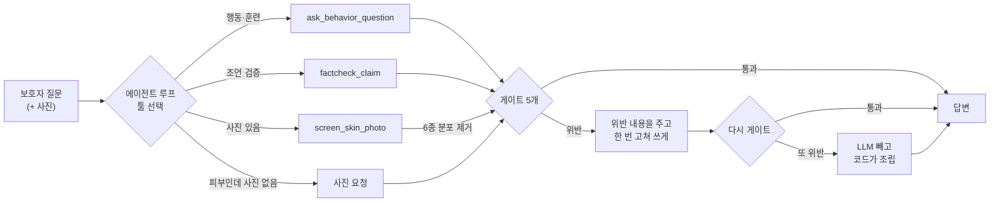

# 🐕 dog-care-agent

**보호자의 말 한 줄과 사진 한 장을 받아, 근거 RAG와 피부 스크리닝 모델을
서브에이전트로 부리는 오케스트레이터.**
요점은 라우팅이 아니라 — **모델이 말해도 되는 것을 코드가 정한다**는 데 있다.


| | |
|---|---|
| [dog-behavior-rag](https://github.com/gayeoniee/dog-behavior-rag) | 행동 상담 RAG — 근거가 있으면 출처와 함께, 없으면 모른다고 |
| [dog-skin-screening](https://github.com/gayeoniee/dog-skin-screening) | 피부 2단계 스크리닝 — EfficientNetV2 + ConvNeXtV2 3팔 앙상블 |

두 저장소는 **손대지 않는다.** 여기서 MCP 서버로 감싸서 부른다.

---

## 왜 만들었나

두 모델을 각각 만들어 놓고 한 화면에 붙이려다가, **붙이는 순간 둘 다 안전하지
않아진다**는 걸 알았다.

피부 모델의 응답 계약에는 **"1등 병변" 필드가 없다.** holdout에서 그 이름이
56.6% 틀려서, 앱이 고를 수 없게 계약에서 아예 뺐다. RAG는 근거가 없으면
**모른다고 말한다** — 범위 밖 질문 거절률 0/4 → 7/7까지 끌어올린 결과다.

그 사이에 LLM을 하나 세우면 둘 다 무력해진다.

- 계약에 1등 필드가 없어도 **분포는 있다.** 6종 확률을 읽은 모델은
  "농포일 가능성이 높아 보입니다"라고 쓴다. 필드를 뺀 의미가 문장에서 되살아난다.
- RAG가 "자료가 없다"고 한 자리에, 모델이 앞뒤를 매끄럽게 이으려고 `[자료 3]`을
  붙이면 **없던 근거가 생긴다.**

팀 프로젝트(DAENGS)에서는 이걸 **피하는 쪽으로** 풀었다. 라우터가 피부를
`handoff`로 빼서 "사진을 올려주세요"까지만 하고 앱에 넘긴다 — 오케스트레이션에
안 들어간다. 여기서는 **들어가게 하고, 대신 말할 수 있는 것을 코드로 못 박았다.**

## 무엇이 다른가

| | 흔한 툴콜링 에이전트 | 이 프로젝트 |
|---|---|---|
| 모델이 보는 것 | 툴 응답 전부 | **6종 분포를 빼고 준다** — 유혹을 프롬프트로 참게 하지 않는다 |
| 안전 규칙 | 시스템 프롬프트 | **`gates.py` 5개** — 테스트 50개가 잡고 있다 |
| 규칙이 깨졌을 때 | 모름 | 한 번 고쳐 쓰게 하고, 또 걸리면 **LLM을 빼고 코드가 조립** |
| 의존성 | 한 venv에 전부 | **서브에이전트마다 자기 venv의 프로세스** (torch ↔ bge-m3 안 다툼) |
| 하나가 죽으면 | 전부 안 뜸 | 나머지로 계속 — 무엇이 빠졌는지 답변에 적힌다 |
| 평가 | 사람이 눈으로 | 라우팅·게이트를 **따로** 재고, 라우팅은 3회 전 회차를 적는다 |

## 동작 방식



서브에이전트는 **stdio MCP 서버**로 뜬다. 각자 자기 레포의 venv 안에서 돈다:

```
uv run --project ../dog-behavior-rag  --extra hf    python mcp_servers/behavior_rag_server.py
uv run --project ../dog-skin-screening --extra train python mcp_servers/skin_screening_server.py
```

## 게이트

`src/dogcare/gates.py`. **LLM의 말이 아니라 툴이 실제로 돌려준 것만** 본다.

| | 막는 것 | 왜 |
|---|---|---|
| **G1** | 병변 6종 이름이 문장에 나옴 | 그 이름이 56.6% 틀린다. 계약에서 필드를 뺀 이유를 문장에서도 지킨다 |
| **G2** | 면책 문구 탈락 | 모델에게 부탁하지 않고 **코드가 붙인다.** 그래서 원문 대조로 잴 수 있다 |
| **G3** | 없는 근거를 가리키는 `[자료 N]` | 자료가 없다고 한 턴의 인용은 모델이 지어낸 번호다 |
| **G4** | 앙상블이 조용히 줄어듦 | 배포에서 3팔이 1팔로 줄었는데 응답은 멀쩡해 보였다(2026-09-07) |
| **G5** | 사진 없이 피부를 판정 | RAG 코퍼스로도 그럴듯한 답은 나온다. 거기엔 이 보호자의 개가 없다 |

G1의 까다로운 자리 — 계열 이름 둘(`미란·궤양`·`결절·종괴`)은 **6종 이름과 글자가
같다.** "궤양"을 무조건 막으면 승인된 계열 문장까지 막힌다. 여는 열쇠는
프롬프트가 아니라 **판정 결과 자신**(`stage2.group`)이다. 확신이 낮아 `group`이
`null`이면 그 턴에는 아무 이름도 못 쓴다.

## 빠른 시작

세 저장소를 나란히 둔다:

```
StudioProjects/
├── dog-care-agent/        ← 여기
├── dog-behavior-rag/
└── dog-skin-screening/
```

```bash
uv sync
cp .env.example .env        # LLM_API_KEY, HF_TOKEN
uv run dogcare health       # 서브에이전트가 붙었나
uv run dogcare ask "산책할 때 줄을 너무 당겨요"
uv run dogcare ask "여기 좀 봐주세요" --image ~/Pictures/dog.jpg --trace
```

가중치 없이 배선만 볼 때는 `SKIN_MOCK=1`.

## 평가

```bash
uv run python evals/run.py gates      # 결정론적 — LLM도 DB도 필요 없다
uv run python evals/run.py record     # 실제 서버에서 툴 스키마를 받아 둔다
uv run python evals/run.py routing    # LLM만 필요 (툴 응답은 고정)
```

## 기술 스택

| 영역 | 사용 |
|---|---|
| 오케스트레이션 | MCP (stdio) · OpenAI 호환 tool calling |
| LLM | Gemini 무료 티어 기본. `LLM_BASE_URL`만 바꾸면 LM Studio / Ollama / vLLM |
| 서브에이전트 | FastAPI+pgvector+bge-m3 (RAG) · PyTorch+timm 3팔 앙상블 (피부) |
| 도구 | uv, pytest, ruff |

## 한계

- **라우팅은 LLM이 한다.** 결정론적 신호(사진 첨부 여부)는 코드가 쓰지만, 나머지는
  모델이 고른다. 그래서 같은 질문에 회차마다 다른 툴을 고를 수 있고, 평가가
  3회 전 회차를 적는 이유가 그것이다.
- **게이트는 말할 수 있는 것을 좁힐 뿐, 답이 좋은지는 못 잰다.** 그건 저쪽 두
  저장소의 평가가 본다.
- **멀티턴이 얕다.** history를 그대로 넘기기만 하고, 턴 사이에 판정 결과를
  들고 다니지 않는다. 앞 턴의 사진을 "그거 말이에요"로 가리키면 못 알아듣는다.
- **보듬TV 자막은 개인·학습 목적으로만 쓴다.** 배포하려면 그 소스를 빼야 한다.
