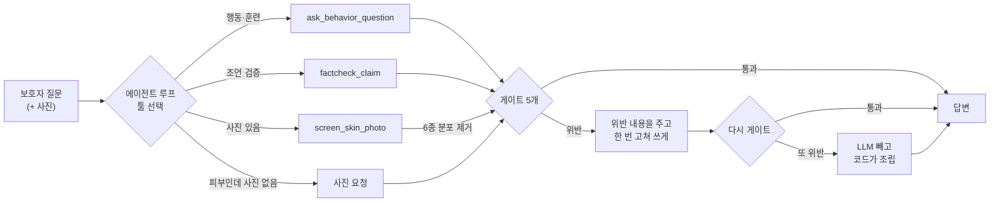

# 🐕 dog-care-agent

**보호자의 말 한 줄과 사진 한 장을 받아, 근거 RAG와 피부 스크리닝 모델을
서브에이전트로 부리는 오케스트레이터.**
요점은 라우팅이 아니라 — **모델이 말해도 되는 것을 코드가 정한다**는 데 있다.


| | |
|---|---|
| [dog-behavior-rag](https://github.com/gayeoniee/dog-behavior-rag) | 행동 상담 RAG — 근거가 있으면 출처와 함께, 없으면 모른다고 |
| [dog-skin-screening](https://github.com/gayeoniee/dog-skin-screening) | 피부 2단계 스크리닝 — EfficientNetV2 + ConvNeXtV2 3팔 앙상블 |

두 저장소는 **손대지 않는다.** 여기서 MCP 서버로 감싸서 부른다.

---

## 왜 만들었나

팀 프로젝트에서 이 두 모델을 만들고 오케스트레이션까지 붙였는데, 피부 쪽은
**모델을 실제로 부르는 게 앱**이고 오케스트레이터는 그 결과를 해설할 뿐이었다.
서브에이전트라고 부르기엔 한 칸이 모자랐고, 그 칸을 넘는 건 팀 일정 안에서
건드릴 크기가 아니었다. 그래서 개인 저장소에서 넘어봤다.

넘어보니 이유가 있었다. **붙이는 순간 두 모델의 안전장치가 같이 무력해진다.**

피부 모델의 응답 계약에는 **"1등 병변" 필드가 없다.** holdout에서 그 이름이
56.6% 틀려서, 앱이 고를 수 없게 계약에서 아예 뺐다. RAG는 근거가 없으면
**모른다고 말한다** — 범위 밖 질문 거절률 0/4 → 7/7까지 끌어올린 결과다.

그 사이에 LLM을 하나 세우면 둘 다 무력해진다.

- 계약에 1등 필드가 없어도 **분포는 있다.** 6종 확률을 읽은 모델은
  "농포일 가능성이 높아 보입니다"라고 쓴다. 필드를 뺀 의미가 문장에서 되살아난다.
- RAG가 "자료가 없다"고 한 자리에, 모델이 앞뒤를 매끄럽게 이으려고 `[자료 3]`을
  붙이면 **없던 근거가 생긴다.**

## 무엇이 다른가

| | 흔한 툴콜링 에이전트 | 이 프로젝트 |
|---|---|---|
| 모델이 보는 것 | 툴 응답 전부 | **6종 이름이 실린 자리를 전부 뺀다** — 유혹을 프롬프트로 참게 하지 않는다 |
| 안전 규칙 | 시스템 프롬프트 | **`gates.py` 6개** — 테스트 71개가 잡고 있다 |
| 규칙이 깨졌을 때 | 모름 | 한 번 고쳐 쓰게 하고, 또 걸리면 **LLM을 빼고 코드가 조립** |
| 의존성 | 한 venv에 전부 | **서브에이전트마다 자기 venv의 프로세스** (torch ↔ bge-m3 안 다툼) |
| 하나가 죽으면 | 전부 안 뜸 | 나머지로 계속 — 무엇이 빠졌는지 답변에 적힌다 |
| 평가 | 사람이 눈으로 | 라우팅·게이트를 **따로** 재고, 라우팅은 3회 전 회차를 적는다 |

## 어디서 이어지는가 — 팀 프로젝트에서 남은 한 칸

이 저장소는 내가 팀 프로젝트([SAJOYO/DAENGS_dev](https://github.com/SAJOYO/DAENGS_dev))
에서 만든 **피부 해설 서브에이전트(D-079)의 다음 칸**이다.

팀에서 피부는 처음에 `handoff` 였다. 라우터가 "사진을 올려주세요"까지만 하고
앱에 넘겼다. 2026-09-16에 **`skin EXECUTE`로 바꿨다** — 라우터·계약·어댑터를
같이 손봤고, 결정 번호가 하나 밀릴 만큼(D-078 → D-079) 여러 갈래가 동시에
굴러갔다. 그 뒤 이틀 동안 후속 수정이 붙었고, 같은 패턴이 보행 비교(D-080)로
복제됐다.

거기까지 가서도 **끝내 안 넘은 선이 하나 있다.**

```
[팀 버전]  앱이 찍는다 → 앱이 /screen/v1/screen 을 부른다 → 판정이 나온다
                                                              ↓
           오케스트레이터는 그 **기록**(verdict + days_ago)을 말로 풀어준다
           ← 사진은 오케스트레이터에 들어오지 않는다

[이 저장소] 오케스트레이터가 **비전 모델을 루프 안에서 툴로 부른다**
           → 같은 턴에서 근거 검색과 합친다
```

서브에이전트라고 불렀지만, 모델을 실제로 부르는 건 앱이었고 오케스트레이터는
결과를 받아 해설할 뿐이었다. 그게 남은 아쉬움이었다. 다음 칸은 페이로드를
텍스트 전용에서 열어야 하고(`SkinPayload`는 사진이 아니라 판정을 받는다),
`_EXECUTE_NAMES`가 `skin`을 일부러 빼고 있으며(명시 신호가 HANDOFF라 넣으면 500),
얼려둔 라우터 벤치마크 v1~v8을 전부 다시 재야 한다. **팀 일정 안에서 건드릴
크기가 아니었다.**

그래서 여기서 넘어봤다. 넘어보니 대가가 있었다 — 아래 표의 오른쪽 칸이 그것이다.

| | 팀 버전 (D-079) | 이 저장소 |
|---|---|---|
| 사진 | 앱이 찍고 앱이 `/screen`을 부른다 | **오케스트레이터가 MCP 툴로 직접** |
| 모델이 보는 판정 | `verdict` + `days_ago` **둘뿐** | verdict + 계열 + 확률 (6종 이름만 제거) |
| 이름 방어 | **계약에 칸이 아예 없음** + `speaks_beyond_screening`이 문장 교체 | `_for_model`이 빼고 + `G1`이 차단 |
| 위반했을 때 | 그 문장만 고정 문구로, 요청은 성공 | 고쳐 쓰게 하고, 또 걸리면 코드가 조립 |
| 사진 + 행동 질문 | 한 턴에 안 합친다 | **한 턴에서 합친다** |

**팀 버전 쪽이 더 엄격하다.** 모델에게 계열도 확률도 주지 않는다 — 칸을
없애는 것이 게이트보다 강한 방어다. 여기는 개선판이 아니라 **더 많이 주고
게이트로 갚은 판**이고, 그 대가로 사진과 근거 검색을 한 턴에서 합칠 수 있다.
값한 교환이었는지는 `evals/`의 숫자가 말한다.

## 동작 방식



서브에이전트는 **stdio MCP 서버**로 뜬다. 각자 자기 레포의 venv 안에서 돈다:

```
uv run --project ../dog-behavior-rag  --extra hf    python mcp_servers/behavior_rag_server.py
uv run --project ../dog-skin-screening --extra train python mcp_servers/skin_screening_server.py
```

## 게이트

`src/dogcare/gates.py`. **LLM의 말이 아니라 툴이 실제로 돌려준 것만** 본다.

| | 막는 것 | 왜 |
|---|---|---|
| **G1** | 병변 6종 이름이 문장에 나옴 | 그 이름이 56.6% 틀린다. 계약에서 필드를 뺀 이유를 문장에서도 지킨다 |
| **G2** | 면책 문구 탈락 | 모델에게 부탁하지 않고 **코드가 붙인다.** 그래서 원문 대조로 잴 수 있다 |
| **G3** | 없는 근거를 가리키는 `[자료 N]` | 자료가 없다고 한 턴의 인용은 모델이 지어낸 번호다 |
| **G4** | 앙상블이 조용히 줄어듦 | 배포에서 3팔이 1팔로 줄었는데 응답은 멀쩡해 보였다(2026-09-07) |
| **G5** | 사진 없이 피부를 판정 | RAG 코퍼스로도 그럴듯한 답은 나온다. 거기엔 이 보호자의 개가 없다 |
| **G6** | 찾아보지 않고 "자료에 없다"고 함 | 코퍼스에 뭐가 있는지는 검색해 봐야 안다. **검색한 뒤의 거절은 정당하다** |

계열 넷(`솟아오른 변화` · `피부 표면·색·두께 변화` · `벗겨지거나 패인 상처` ·
`깊거나 단단한 혹`)은 보호자 말이라 **6종과 글자가 하나도 안 겹친다.** 그래서
계열 문장은 G1을 건드리지 않는다. 옛 이름은 겹쳤고(`미란·궤양`은 A5와 같은
글자였다) 그때는 `stage2.group`이 열쇠였다 — 그 배선은 남겨 뒀다. 승인의 출처는
프롬프트가 아니라 **판정 결과 자신**이라는 규칙이 거기 들어 있다.

## 실제로 돌린 결과

사진은 PMC 오픈액세스 수의피부과 증례(코 옆 1cm 열창)에서 가져왔다.
가중치는 허깅페이스 `gayoniee/daengs-skin-screening-release@v1` — **DAENGS
개발 서버가 쓰던 그 릴리스**다.

```
$ uv run dogcare ask "코 옆이 찢어진 것처럼 벌어졌어요 어떻게 해야 하나요"       --image case_ulcer.jpg --box 0.19,0.23,0.28,0.29 --trace

[agent] 2단계 앙상블 3팔: convnextv2_base_m2.5 · effnetv2_s_f320 · effnetv2_s_m2.5
────────────────────────────────────────────────────────────
피부에 이상 소견이 보입니다.

모양만 보면 벗겨지거나 패인 상처에 가깝습니다. 까짐, 진물, 출혈, 깊게 패인 부위
같은 모습이 보이는 상태예요. 무엇 때문인지까지는 이 사진만으로 알 수 없습니다.

수의사 진료를 받아보시기를 권합니다.

이 결과는 수의학적 진단이 아니며, 수의사의 진료를 대체하지 않습니다.
참고용 스크리닝 정보로만 사용해 주세요.
────────────────────────────────────────────────────────────
툴 1회: screen_skin_photo(14117ms) · 왕복 2회 · 42231ms
```

기록(`traces/`)을 열어 보면:

| | |
|---|---|
| `stage1.abnormal_prob` | 0.8775 (임계값 0.1466) |
| `stage2.group` | 벗겨지거나 패인 상처 · prob 0.8172 · confidence 0.7171 |
| `stage2.distribution` · `labels` | **없음** — 모델에게 안 준다 |
| `meta.stage2_arms` | 3 · crops `[m2.5, f320, m2.5]` |
| 답변에 샌 6종 어휘 | **없음** |
| 게이트 | 통과 |

계열은 A5(`미란·궤양`)에 해당하는 묶음인데, **답변에 "미란"도 "궤양"도 안 나온다.**
면책 문구는 모델이 쓴 게 아니라 코드가 붙였다.

## 숫자

| | |
|---|---|
| 게이트 (결정론적) | 막아야 할 것 **9/9** · 헛걸림 **0/7** |
| 라우팅 (3회 전 회차 통과) | **11/15** — 아래 "한계" 참조 |
| 단위 테스트 | **71** |
| RAG 코퍼스 | 612문서 · 9,768청크 · bge-m3(1024d) |
| 피부 | 2단계 3팔 앙상블 · stage1 임계값 0.1466 |

평가가 실제로 잡은 것들:

- **`"빨갛"`만 넣어서 "배가 자꾸 빨개져요"를 놓쳤다.** G5가 안 켜졌다.
  한국어는 어간이 바뀐다 — 형태를 나열해야 한다
- **모델이 찾아보지도 않고 "자료에 없습니다"라고 답했다.** 코퍼스에 대한
  거짓말이다. G6을 새로 만들었고, 걸리면 루프가 **"가서 찾아보라"**고
  되돌려 보낸다 (다른 위반은 문장만 고치게 한다)

## 빠른 시작

세 저장소를 나란히 둔다:

```
StudioProjects/
├── dog-care-agent/        ← 여기
├── dog-behavior-rag/
└── dog-skin-screening/
```

폴더 이름이 다르면 `.env` 에서 가리킨다 (`BEHAVIOR_RAG_REPO` · `SKIN_REPO`).
MCP 서버는 그 경로를 `uv run --project` 에 그대로 넘긴다.

```bash
uv sync
cp .env.example .env        # LLM_API_KEY, HF_TOKEN
uv run dogcare health       # 서브에이전트가 붙었나
uv run dogcare ask "산책할 때 줄을 너무 당겨요"
uv run dogcare ask "여기 좀 봐주세요" --image ~/Pictures/dog.jpg --trace
```

가중치 없이 배선만 볼 때는 `SKIN_MOCK=1`.

## 평가

```bash
uv run python evals/run.py gates      # 결정론적 — LLM도 DB도 필요 없다
uv run python evals/run.py record     # 실제 서버에서 툴 스키마를 받아 둔다
uv run python evals/run.py routing    # LLM만 필요 (툴 응답은 고정)
```

## 기술 스택

| 영역 | 사용 |
|---|---|
| 오케스트레이션 | MCP (stdio) · OpenAI 호환 tool calling |
| LLM | Gemini 무료 티어 기본. `LLM_BASE_URL`만 바꾸면 LM Studio / Ollama / vLLM |
| 서브에이전트 | FastAPI+pgvector+bge-m3 (RAG) · PyTorch+timm 3팔 앙상블 (피부) |
| 도구 | uv, pytest, ruff |

## 한계

- **라우팅은 LLM이 한다.** 결정론적 신호(사진 첨부 여부)는 코드가 쓰지만, 나머지는
  모델이 고른다. 그래서 같은 질문에 회차마다 다른 툴을 고를 수 있고, 평가가
  3회 전 회차를 적는 이유가 그것이다.
- **게이트는 말할 수 있는 것을 좁힐 뿐, 답이 좋은지는 못 잰다.** 그건 저쪽 두
  저장소의 평가가 본다.
- **사진과 행동 질문을 같이 물으면 피부만 본다.** "여기 빨간데 산책을 줄여야
  하나요"에 `screen_skin_photo`만 부르고 `ask_behavior_question`은 안 부른다
  (3회 모두). 라우팅 11/15의 실패 하나가 이것이다
- **범위 밖 질문에 검색을 건너뛴다.** "고양이 모래"·"중성화 비용"에 RAG를 안
  부르고 자기가 거절한다. G6이 **거짓말은** 막지만 라우팅 자체는 못 고친다 —
  게이트와 라우팅은 다른 문제이고, 평가도 따로 잰다
- **멀티턴이 얕다.** history를 그대로 넘기기만 하고, 턴 사이에 판정 결과를
  들고 다니지 않는다. 앞 턴의 사진을 "그거 말이에요"로 가리키면 못 알아듣는다.
- **무료 티어가 불안정하다.** `gemini-3.6-flash`는 503(high demand)이 잦아
  `gemini-3.1-flash-lite`를 기본으로 뒀다. 429/503은 지수 백오프로 재시도한다
- **보듬TV 자막은 개인·학습 목적으로만 쓴다.** 배포하려면 그 소스를 빼야 한다.
